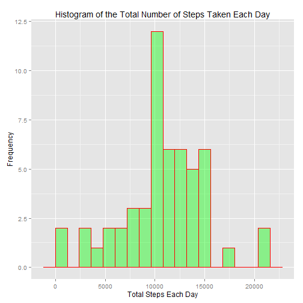
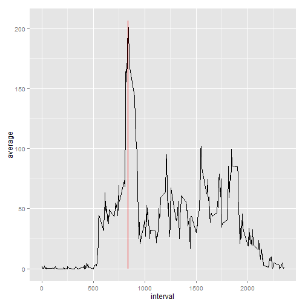
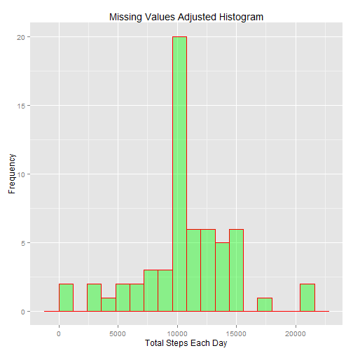
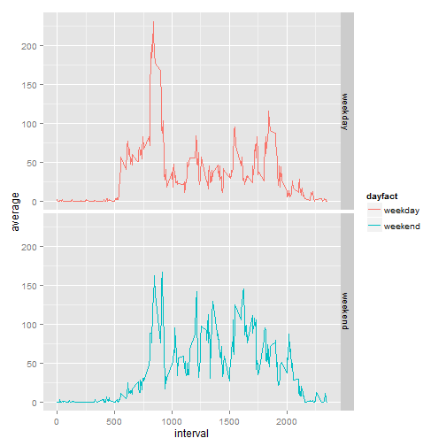

## Part 1: Loading and preprocessing the data


```r
raw.data<-read.csv(file.choose(),header=T)
head(raw.data)
```

```
##   steps       date interval
## 1    NA 2012-10-01        0
## 2    NA 2012-10-01        5
## 3    NA 2012-10-01       10
## 4    NA 2012-10-01       15
## 5    NA 2012-10-01       20
## 6    NA 2012-10-01       25
```

```r
summary(raw.data) 
```

```
##      steps                date          interval     
##  Min.   :  0.00   2012-10-01:  288   Min.   :   0.0  
##  1st Qu.:  0.00   2012-10-02:  288   1st Qu.: 588.8  
##  Median :  0.00   2012-10-03:  288   Median :1177.5  
##  Mean   : 37.38   2012-10-04:  288   Mean   :1177.5  
##  3rd Qu.: 12.00   2012-10-05:  288   3rd Qu.:1766.2  
##  Max.   :806.00   2012-10-06:  288   Max.   :2355.0  
##  NA's   :2304     (Other)   :15840
```

## Part 2: What is mean total number of steps taken per day?


```r
options(scipen=1,digits=2)
data1<-raw.data[!is.na(raw.data$steps),]
data1$date<-factor(data1$date)

library(plyr)
sum.day<-ddply(data1,.(date),summarise,total=sum(steps))

library(ggplot2)
g<-ggplot(sum.day,aes(sum.day$total))
g<-g+geom_histogram(col="red",fill="green",alpha=0.4,binwidth=1200)
g<-g+xlab("Total Steps Each Day")+ylab("Frequency")
g<-g+ggtitle("Histogram of the Total Number of Steps Taken Each Day")
g
```

 

```r
ave<-mean(sum.day$total)
med<-median(sum.day$total)
```
The mean of total number of steps taken per day is 10766.19.

The median of total number of steps taken per day is 10765.

## Part 3: What is the average daily activity pattern?


```r
options(scipen=1,digits=2)
ave.int<-ddply(data1,.(interval),summarise,average=mean(steps))
max.ave<-max(ave.int$average)
max.int<-ave.int[ave.int$average==max.ave,1]
max.int.adj<-max.int-5
g<-ggplot(ave.int,aes(x=interval,y=average))+geom_line()
g<-g+geom_segment(aes(x=max.int,y=0,xend=max.int,yend=max.ave),col="red")
g
```

 

The maximum number of steps is 206.17.

It occurse between 830 minute and 835 minute.

## Part 4: Imputing missing values

```r
n.na<-sum(is.na(raw.data$steps))
```
The total number of missing values in the dataset is 2304.

Fill in the missing values with the mean of taht 5-minute interval.

```r
N<-nrow(raw.data)
attach(raw.data)
tstep<-numeric(N)
for (i in 1:N){
  if(is.na(steps[i])) tstep[i]=ave.int[ave.int$interval==interval[i],2]
	else tstep[i]=steps[i]
}
detach(raw.data)
data2<-raw.data
data2$steps<-tstep

sum.day2<-ddply(data2,.(date),summarise,total=sum(steps))
g<-ggplot(sum.day2,aes(sum.day2$total))
g<-g+geom_histogram(col="red",fill="green",alpha=0.4,binwidth=1200)
g<-g+xlab("Total Steps Each Day")+ylab("Frequency")
g<-g+ggtitle("Missing Values Adjusted Histogram")
g
```

 

```r
ave2<-mean(sum.day2$total)
med2<-median(sum.day2$total)
```

After filling in the missing values:

The mean total number of steps taken per day is 10766.19,
which is the same as the number in part 1.

The median total number of steps taken per day is 10766.19,
which is slightly higher than the one in part 1.

## Part 5: Are there differences in activity patterns between weekdays and weekends?


```r
tdate<-weekdays(as.Date(data2$date))
dayfact<-character(N)
for (i in 1:N){
  if(tdate[i]=="Saturday"|tdate[i]=="Sunday") dayfact[i]="weekend"
	else dayfact[i]="weekday"
}
dayfact<-factor(dayfact)

data3<-data.frame(data2,dayfact)
aveday<-ddply(data3[dayfact=="weekday",],.(interval),
              summarise,average=mean(steps))
aveday$dayfact<-"weekday"
aveend<-ddply(data3[dayfact=="weekend",],.(interval),
              summarise,average=mean(steps))
aveend$dayfact<-"weekend"

data4<-rbind(aveday,aveend)

g<-ggplot(data4,aes(x=interval,y=average))
g<-g+facet_grid(dayfact~.)+geom_line(aes(colour=dayfact))
g
```

 

It seems the activity patterns between weekdays and weekends are a little bit different.
